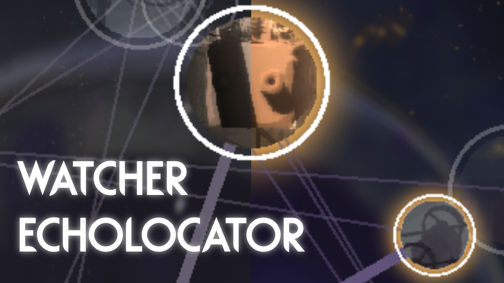

# Watcher Echolocator

  
   
  (Steam Workshop: https://steamcommunity.com/sharedfiles/filedetails/?id=3456628202)

**Watcher Echolocator** is a mod for Rain World which adds a golden glow around regions still containing an echo on the Watcher warp map.

<b><ins>Note:</ins> As of Rain World v1.10.2, a system functionally the same as this mod (although visually different) has been added to the base Watcher expansion,
with regions containing an unvisited echo now showing a golden ring around them.</b>

## Installation:
1. Download the mod from the [Steam Workshop](https://steamcommunity.com/sharedfiles/filedetails/?id=3456628202).\
**OR:**
    1. Download the zip file from the [Releases](https://github.com/SabreML/WatcherEcholocator/releases) section.
    2. Move the `watcherecholocator` folder from the zip file to `\Steam\steamapps\common\Rain World\RainWorld_Data\StreamingAssets\mods`.
2. Activate the mod in the in-game 'Remix' menu.

## Compatibility:
This mod was designed for Rain World: The Watcher v1.10.1+, and requires 'The Watcher' to be enabled in the Remix menu.